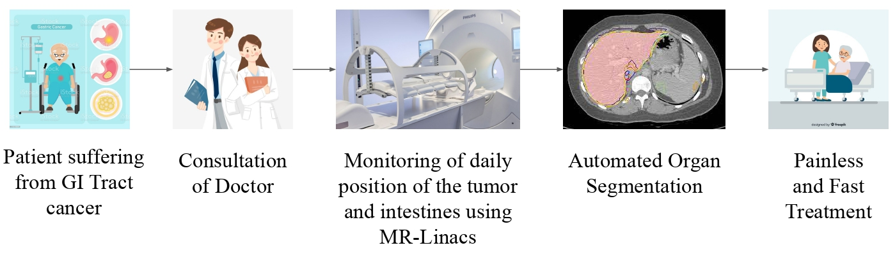
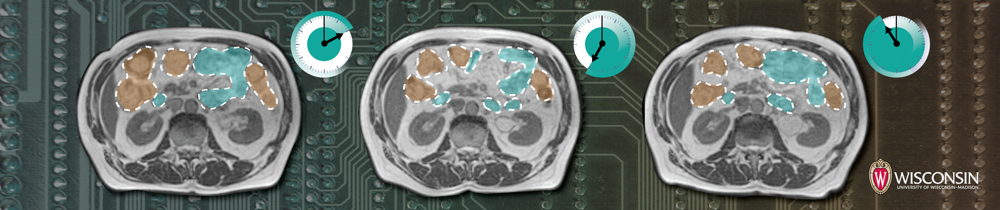

# GI-Tract-Segmentation
This is the official implementation of our paper titled: Medical Image Segmentation using LeViT-UNet++: A Case Study on GI Tract Data, submitted to review at the **2022 16th International Conference on Advanced Computing and Analytics (ACOMPA)** 

## Authors:
Praneeth Nemani, Satyanarayana Vollala

## Abstract
Gastro-Intestinal Tract cancer is considered a fatal malignant condition of the organs in the GI tract. Due to its fatality, there is an urgent need for medical image segmentation techniques to segment organs to reduce the treatment time and enhance the treatment. Traditional segmentation techniques rely upon handcrafted features and are computationally expensive and inefficient. Vision Transformers have gained immense popularity in many image classification and segmentation tasks. To address this problem from a transformers' perspective, we introduced a hybrid CNN-transformer architecture to segment the different organs from an image. The proposed solution is robust, scalable, and computationally efficient, with a Dice and Jaccard coefficient of 0.79 and 0.72, respectively. The proposed solution also depicts the essence of deep learning-based automation to improve the effectiveness of the treatment.  

## Conceptual Overview

## Dataset
We use the UW-Madison GI Tract Image Segmentation dataset to segment the different organs in this work. This dataset consists of about 38000 16-bit grayscale images in the .png format and their annotations in the form of RLE-encoded masks. Multiple sets of scan slices represent each instance (each set is identified by the day the scan took place). Some cases are divided into time segments, while other instances are divided into case segments, with the entire case being in the train set.

